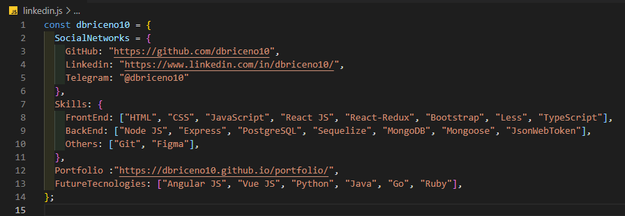

### Hola, mi nombre es Daniel Briceño 👋

#### Soy Full-Stack Developer.

Hola 🖐️😉, mi nombre es Daniel Briceño, Full Stack Developer.💻🤓

Soy entusiasta de la educación digital y apasionado de la educación efectiva 💻🤓, del rápido aprendizaje y del crecimiento personal y profesional, me encanta crear productos digitales. Aunque mi especialidad es frontend, hoy me estoy desarrollando como especialista en backend para ser un fullstack web javascript developer. 📲💻📲💻📲💻

La comunicación y el trabajo en equipo es para mí esencial para poder crecer como desarrollador. Soy proactivo y metódico, siempre busco nuevos retos y me adapto fácilmente a los cambios, estoy abierto a aprender nuevas tecnologías y lenguajes.

✅ Mis Skills: HTML, CSS, JavaScript, React JS, React-Redux, TypeScript, Bootstrap, Less, Next Js, Node JS, Express, GraphQL, SQL, PostgreSQL, Sequelize, MongoDB, Mongoose, JsonWebToken, Figma, Git.

<h3 align="left">Tecnologías:</h3>

   

 
 

 
<!--   -->

 

 
 
 
<!--  -->

 

- 🔭 Puedes ver más de mis proyectos en: https://dbriceno10.github.io/portfolio/
- 🌱 Sigo aprendiendo React JS, Node JS, JavaScript, Figma, Express, MongoDB, PostgreSQL, Sequelize, TypeScript, Next Js, GraphQL.
- 👯 Deseo Aprender Angular JS, Vue JS, React-Native, Python Java, Ruby, Go.
- 📫 ¿Cómo contactarme?
- ✅ Telegram: https://t.me/dbriceno
- ✅ Linkedin: https://www.linkedin.com/in/dbriceno10/
- ✅ Portafolio: https://dbriceno10.github.io/portfolio/#/contact
- ✅ Correo: dbriceno10dev@gmail.com
- ✅ Twitter: https://twitter.com/dbriceno10dev
- ✅ Torre: https://torre.co/dbriceno10?s=hWuAmyFOFx

  
